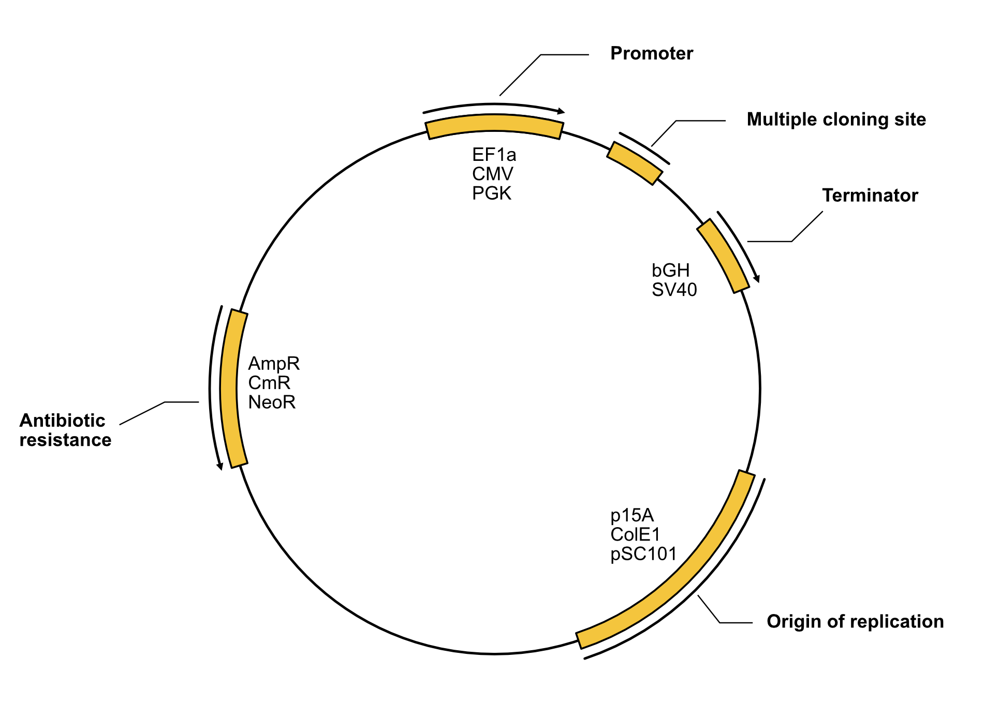
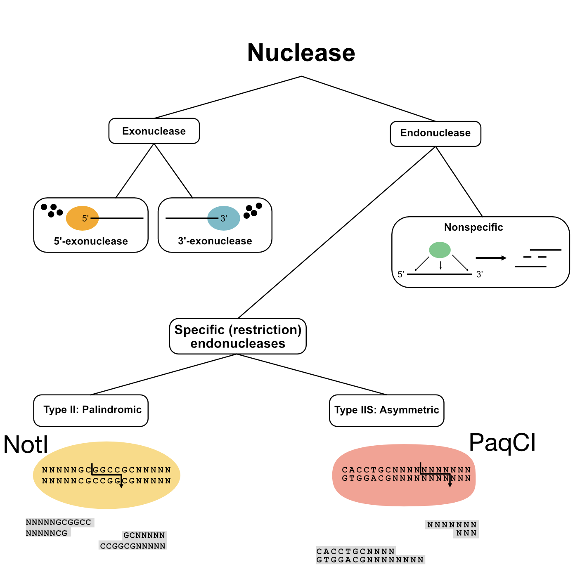
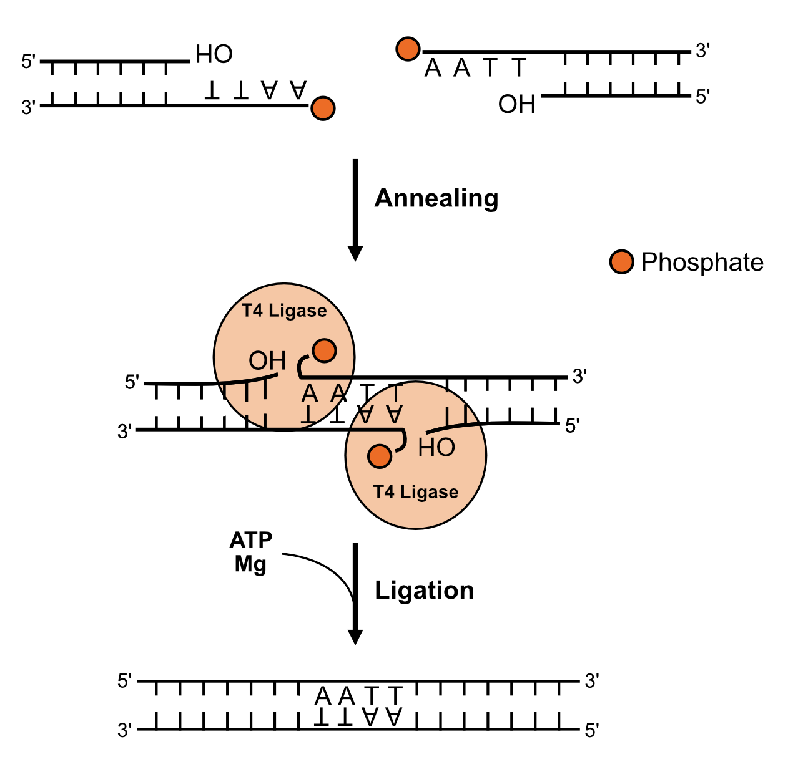

# A Practical Introduction to Molecular Biology

## Table of Contents

- [Section 1: Plasmid Cloning](#section-1-plasmid-cloning)
  - [1.1 Background: Molecular Biology Fundamentals](#11-background-molecular-biology-fundamentals)
  - [1.2 Lab-Specific Resources](#12-lab-specific-resources)
  - [1.3 Protocol: Restriction Enzyme Cloning](#13-protocol-restriction-enzyme-cloning)
  - [1.4 Protocol: Golden Gate Assembly](#14-protocol-golden-gate-assembly)

---

## Section 1: Plasmid Cloning

Cloning is the process of assembling a DNA construct — typically a gene of interest in a defined vector backbone — so that it can be propagated in bacteria and expressed in a target organism. You will learn two complementary cloning strategies: classical restriction enzyme/ligation cloning and the modern Golden Gate assembly method.

### 1.1 Background: Molecular Biology Fundamentals

#### 1.1.1 DNA, Plasmids, and Vectors

A plasmid is a circular piece of DNA, with no start or end. Circular DNA is highly stable, since it has no free 5’ or 3’-hydroxyl ends for **nucleases** to target. Plasmids were originally derived from bacteria, which harbor various kind of plasmids encoding genes for reproduction, antibiotic resistance, and virulence. Humans can take advantage of plasmids as a vector for genetic alteration or introduction of a perturbation to an organism. Plasmids can vary widely, but those used for routine gene expression contain the following: 

- **Origin of replication**: the region of the plasmid that allows it to be propagated inside of a bacterium.

- **Antibiotic resistance**: a selection marker. Cells carrying this gene grow in the presence of an antibiotic, thus showing which cells are carrying the plasmid we want. Cells that are untransformed (not carrying the plasmid) die.

- **Multiple cloning site (MCS)**: The site where (in traditional restriction/ligation cloning) the gene of interest can be inserted. The MCS is usually sandwiched between the promoter and the terminator.

- **Promoter**: The region of the plasmid that recruits the transcription machinery in the target organism. Notably, this gene is not expressed in the bacterium.

- **Terminator**: The region of the plasmid that signals the transcription machinery to stop synthesizing mRNA. Usually coupled with a **poly-adenylation** (polyA) signal.

Because a plasmid is circular and double stranded and thus a palindrome, the features encoded in this DNA have a pre-defined direction based on the biochemistry of transcription and replication. We read a sequence from 5' to 3', meaning the first base of the sequence is that which has a free 5'-OH group, and the end base has a free 3'-OH. An example of a plasmid is below, with the features marked in bold, the direction we read the feature as an arrow, and some examples of the sequences. Origins of replication and MCS do not have a read direction.

#### 1.1.2 Restriction Enzymes

**Nucleases** are a class of enzyme that acts to break down nucleic acids (DNA, RNA, etc). DNases (DNA nucleases), come in two flavors: exonuclease and endonucleases. Exonucleases, like their name suggests, act to digest DNA from its terminal 5'-OH or 3'-OH ends and are highly efficient at degrading DNA. In contrast, endonucleases cut DNA from inside and can be **nonspecific** or cut only at a recognized sequence (restriction endonucleases).

Type II and type IIS restriction enzymes are commonly used in molecular cloning due to their ability to recognize and cut at specific sequences of DNA. Type II enzymes recognize palindromic sequences of DNA and cut, leaving either sticky (ends with single-stranded overhangs) or blunt (coherent base paired) ends. Type IIS enzymes recognize a specific sequence, but do not cleave it. Instead, they cut specific sequences downstream, leaving sticky ends that can be any sequence.

Like everything in biology, restriction enzymes are not perfect. Oftentimes, there is a **consensus** sequence where enzymes cut, but this sequence is not always strictly obeyed. Therefore, enzymes exhibit **star activity**, or off-target cutting. An example of this is the restriction enzyme BamHI, where the most common cutting sequence is `G|GATCC` but depending on salt concentration and pH, it can cut at other sites.

#### 1.1.3 DNA Ligation

As you may have recognized, when using the correct restriction enzymes on both your backbone and your insert, you will have palindromic sequences that can base pair. This is the main reason we use Type II restriction enzymes: to guide assembly of two or more pieces of DNA based on their end homology. Restriction digests can give us these pieces of DNA, but we use DNA ligation to stitch them together.

The most common form of DNA ligase used in the lab is T4 DNA ligase, an enzyme that catalyzes the formation of a **phosphodiester** bond between a 5'-phosphate and an adjacent 3'-OH group. T4 ligase uses ATP to catalyze the reaction to join two DNA molecules with homology.

#### 1.1.4 Golden Gate Assembly

Traditional **restriction/ligation** cloning using type II enzymes and a T4 ligase is useful for joining one or two inserts into vector. This requires *multiple* restriction enzymes, each with a different recognition sequence. Since the pool of palindromic sequences between 5 and 6 nucleotides in length is limited, increasing the number of inserts becomes very difficult. This is why we turn to type IIS restriction enzymes for multi-insert cloning.

Recall in [section 1.1.2](#112-restriction-enzymes), type IIS restriction enzymes do not cut at their cognate recongition sequence, but instead cut asymmetrically. This leaves an sticky-end of *any* nucleotide sequence `NNNN`. If designed correctly, the sequences of overhanging DNA in each of your fragments will complement with each other, allowing for **annealing** and subsequent ligation with T4 ligase. This technique was originally published in 2008, under the name [Golden Gate](https://journals.plos.org/plosone/article?id=10.1371/journal.pone.0003647).

Although it requires some very precise design, one can design a vector that has a self-excising type IIS restriction site that matches directly with the overhangs left from the type IIS site on the fragments you want to insert. Since the overhangs can be any sequence of `NNNN`, one can theoretically ligate up to 128 fragments simultaneously in one reaction. In reality, though, Golden Gate is rarely used to ligate more than 7 fragments due to mismatches during annealing.

---

### 1.3 Protocols: Restriction Enzyme Cloning

#### [1.3.1 PCR Amplification of Insert](./protocols/pcr.md)

#### [1.3.2 Restriction Digest](./protocols/restriction_digest.md)

#### 1.3.3 Gel Extraction & Cleanup

PCR and restriction digest cleanup: Zymo Research's [DNA Clean & Concentrate Kit](https://www.zymoresearch.com/products/dna-clean-concentrator-5)

Gel purification: NEB's [Monarch DNA Gel Extraction Kit](https://www.neb.com/en-us/products/t1020-monarch-dna-gel-extraction-kit)

#### [1.3.4 Ligation Reaction](./protocols/t4_ligase.md)

#### [1.3.5 Bacterial Transformation](./protocols/chemical_transformation_of_e_coli.md)

---

### 1.4 Protocol: Golden Gate Assembly

#### 1.4.1 [One-Pot Assembly Reaction](protocols/golden_gate.md)

#### [1.4.2 Bacterial Transformation](./protocols/chemical_transformation_of_e_coli.md)

